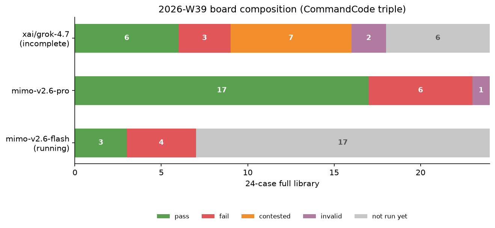

# 2026-W39 — CommandCode triple exam: grok-4.7 (incomplete) / mimo-v2.6-pro / mimo-v2.6-flash (running)

**Summary**: This week's main event is the CommandCode triple (owner directive 2026-09-22). The grok-4.7 leg hit the lane's 5h + weekly quota wall after 10/27 runs ($14.02/$14; the kill-switch stopped the exam cleanly, zero bad runs) — **incomplete**: 6 pass, 3 fail, 2 invalid, plus 7 cases contested and 6 cases not run, awaiting the 09-29 weekly reset for a same-lane re-exam. mimo-v2.6-pro: **17/24** (1 invalid). mimo-v2.6-flash: still running (3 pass, 4 fail across 7 runs at press time). Two headlines: ① A-87c472cb scored 6/8 on all three lanes — everyone falls in the same pit; ② A-d511f9e8 went invalid_infrastructure on both the g47 and m26p lanes — a case-level infrastructure suspicion on this lane. The same-day Nous Portal half-price-week grok-4.7 control batch (13/24, 0 contested, delivery failure proven) **does not live in this repo** — a different provider is a different candidate; see [amber-nous](https://github.com/getaskclaw/amber-nous) 2026-W39.

中文: [2026-W39.md](2026-W39.md)

---

## Run identity (three legs, same provider, same subscription pool)

| field | cc-g47 (incomplete) | cc-m26p | cc-m26f (running) |
|---|---|---|---|
| model | `xai/grok-4.7` | `xiaomi/mimo-v2.6-pro` | `xiaomi/mimo-v2.6-flash` |
| provider | CommandCode (api.commandcode.ai, GOAT subscription lane) | same | same |
| band | high | high | high |
| window (UTC) | 2026-09-22 00:39 → quota wall (5h window $14.02/$14 exhausted) | 2026-09-22 (finished in stops and starts between windows) | 2026-09-22 10:26 → (running) |
| completion | 25/27 runs (18 cases with runs, 6 not run) | 27/27 runs | 7/27 runs (at press time) |
| wire verification | state.db audit: every run `xai/grok-4.7` @ commandcode | state.db audit: every run `xiaomi/mimo-v2.6-pro` @ commandcode | running |
| cost | subscription quota lane ($14.02 burned in one window) | subscription quota lane | subscription quota lane |

Clean-room profiles, no fallback chains; 2-concurrency cap; oracle sha pinned for every scored run; the catalog has no pricing field, so subscription-lane cost can only be reported as tokens after the fact.

## Full matrix

Case handles are public aliases (cross-checked against the [amber hash-index](https://github.com/getaskclaw/amber)). Marks: ✓ pass / ✗ fail (d2 score) / ⊘ contested (quota-wall hold, awaiting re-exam) / ◍ invalid_infrastructure / — not run / ⏳ running.

| case | face | cc-g47 | cc-m26p | cc-m26f (running) |
|---|---|---|---|---|
| A-77d62143 | build(custody) | ✓ 8/8 | ✓ 8/8 | ✓ 8/8 |
| A-569dbe0d | build(ETL) | ✓ 10/10 | ✓ 10/10 | ✓ 10/10 |
| A-87c472cb | build | ✗ 6/8 | ✗ 6/8 | ✗ 6/8 |
| A-641195e2 | build | ✓ 8/8 | ✓ 8/8 | ✓ 8/8 |
| A-442d4aab | build | ✓ 7/7 | ✓ 7/7 | ⏳ |
| A-61f7ad01 | build(UI) | ✗ 5/7 | ✓ 7/7 | ⏳ |
| A-d511f9e8 | verify | ◍ | ◍ | ⏳ |
| A-a317e74b | verify | ✗ 14/15 | ✗ 10/15 | ⏳ |
| A-be92627f | verify | ✓ 9/9 | ✗ no deliverable | ⏳ |
| A-cdc3d11a | review | ⊘ contested | ✗ -10 | ⏳ |
| A-47eea242 | review | ⊘ contested | ✓ 4 | ⏳ |
| A-ea80d793 | vision | ⊘ contested | ✗ -2 | ⏳ |
| A-791e90ac | text | ⊘ contested | ✓ 6/6 | ✗ no code block |
| A-1fd3683a | text | ⊘ contested | ✓ 2/2 | ✗ no code block |
| A-13854d9d | text | ⊘ contested | ✓ 5/5 | ✗ no code block |
| A-d9b79b46 | ui-build | — | ✗ | ⏳ |
| A-0676097b | req-drift | — | ✓ 4/4 | ⏳ |
| A-a5608487 | ops | ✓ | ✓ | ⏳ |
| A-984e80ee | ops | ⊘ contested | ✓ | ⏳ |
| A-24bcf707 | ops | ◍ | ✓ | ⏳ |
| A-8d4bc770 | ops | — | ✓ | ⏳ |
| A-6fbeb363 | ops | — | ✓ | ⏳ |
| A-8c909d0a | ops | — | ✓ | ⏳ |
| A-3f2a9cdd | convergence | — | ✓ | ⏳ |
| **total** | | **incomplete** (6 pass 3 fail 7⊘ 2◍ 6—) | **17/24** (1◍) | running (3 pass 4 fail / 7 runs) |

## Findings

1. **A-87c472cb: 6/8 on all three lanes** — everyone falls in the same pit, reported without makeup (the ±8h boundary family of old traps). Case-level problem suspected.
2. **A-d511f9e8 went invalid_infrastructure on both the g47 and m26p lanes** (hit the 1800s cap twice) — the Nous control lane ran the same case for real (4/12; see [amber-nous W39](https://github.com/getaskclaw/amber-nous)), so the case can be tested, and this lane needs to explain why it keeps dying on infrastructure here.
3. **Attribution pins A-a317e74b**: g47 at 14/15 enters the best-in-history band (passing still requires all pins, so it counts as a fail); m26p 10/15.
4. **The three text-face cases**: m26p passed all (6/6, 2/2, 5/5), proving the cases are passable; m26f returned no code block on all three — flash delivery reliability is in doubt, to be confirmed when it finishes.
5. **m26p highlights**: 4 on A-47eea242 (ties the best in history, the W37 record); ops face 6/6; its only invalid is Finding 2's A-d511f9e8.
6. **Winds shifting on g47's 7 contested cases**: the same-day Nous control lane reproduced the same failure shape on 6 of those cases in a wall-free environment (plan-and-stop delivery failure; details in [amber-nous W39](https://github.com/getaskclaw/amber-nous)). Wall or disease — the 09-29 same-lane re-exam decides. The board keeps them contested; we do not clear them early.

## Harness notes

- Multi-variant cases (A-0676097b, 4 runs sharing one bundle) count as one case and must go all-green: m26p went 4/4.
- g47 quota-wall evidence chain: billing API $14.02/$14 + 503 probes from two machines agreeing; the driver kill-switch stopped the exam, zero bad runs; the 7 contested cases are booked (`scoring-contested-cc-g47.txt`, commit 7743a12e); m26f's 2 invalid runs from a hot-window start were wiped and re-sat.
- Three orchestration incidents recorded in the launch md (marker-name typo / bare profile name / systemd PATH), all fixed same-day; no effect on the papers.
- The running leg (cc-m26f) will update the total row and Findings when it finishes; the board is versioned by git history.

## Verdict (for now)

- **mimo-v2.6-pro**: 17/24, balanced and usable — ops 6/6, text face all pass, A-47eea242 ties the best in history. Safe for build / ops / text jobs.
- **grok-4.7 (this lane)**: no rating while incomplete; on the runs it did sit, the root-cause pins (14/15) are the highlight, build face 4/6. For delivery-reliability doubts see the amber-nous control board.
- **mimo-v2.6-flash**: still running; verdict when it finishes.
